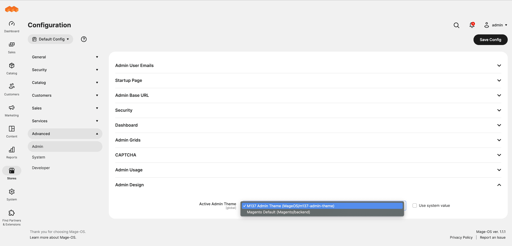

# Mage-OS Theme Adminhtml Switcher

## Features

This module enables M137 Admin Theme for Mage-OS and allows admin users to select the active admin theme via configuration. This is a companion module to the [mage-os/theme-adminhtml-m137](https://github.com/mage-os-lab/theme-adminhtml-m137)

## Installation

This module is included as part of Mage-OS M137 Admin Theme ([mage-os/theme-adminhtml-m137](https://github.com/mage-os-lab/theme-adminhtml-m137)) and is recommended to be installed via the theme package. Individual installation instructions are provided below, if needed:

```
composer require mage-os/module-theme-adminhtml-switcher
bin/magento module:enable MageOS_ThemeAdminhtmlSwitcher
bin/magento setup:upgrade
```

## Contribution

Install the module and theme locally

```
git clone git@github.com:mage-os-lab/module-theme-adminhtml-switcher.git ./app/code/MageOS/ThemeAdminhtmlSwitcher/
git clone git@github.com:mage-os-lab/theme-adminhtml-m137.git ./app/design/adminhtml/MageOS/theme-adminhtml-m137/
```

## Configuration



```
Stores > | Settings | Configuration > Advanced > Admin > Admin Design
```

```
Active Admin Theme: select the desired theme from those installed
```

## Changelog

Please see [CHANGELOG](CHANGELOG.md) for more information on what has changed recently.

## License

The MIT License (MIT). Please see [License File](LICENSE) for more information.
