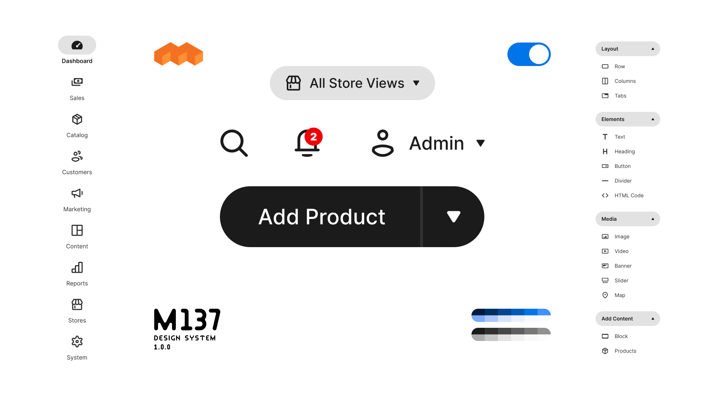

# M137 Admin Theme

This is the Mage-OS Admin Theme

It is based on top of out of the box `Magento/backend` theme

Design reference: [M137 Design System](https://www.figma.com/community/file/1486802857979032188)




## Installation

Theme requires [module-theme-adminhtml-switcher](https://github.com/mage-os-lab/module-theme-adminhtml-switcher) to be installed

```
composer require mage-os/theme-adminhtml-m137
bin/magento module:enable MageOS_ThemeAdminhtmlSwitcher
bin/magento setup:upgrade
```

## Contribution

Install the theme and the module locally

```
git clone git@github.com:mage-os-lab/theme-adminhtml-m137.git ./app/design/adminhtml/MageOS/theme-adminhtml-m137/
git clone git@github.com:mage-os-lab/module-theme-adminhtml-switcher.git ./app/code/MageOS/ThemeAdminhtmlSwitcher/
```

## Features

- UI update, minimalism and the aesthetic of the interface
- New typography: `Inter` font family
- New color schema, Hue Chroma Tone (HCT) color space
- Brand new icons: Mage-OS, Magento Open Source, Page Builder

### Feature/Page Coverage

- [x] Dashboard
- [ ] Sales
    - [x] Orders
        - [x] Order
            - [x] Billing Address Edit
            - [x] Shipping Address Edit
            - [x] Edit
    - [x] Invoices
        - [x] Invoice
            - [x] Billing Address Edit
            - [x] Shipping Address Edit
    - [x] Shipments
        - [x] Shipment
    - [x] Credit Memos
        - [x] Credit Memo
    - [ ] Billing Agreements
        - [ ] Billing Agreement
    - [ ] Transactions
        - [ ] Transaction
- [x] Catalog
    - [x] Products
        - [x] Product
            - [x] Advanced Price Popup
            - [x] Field Category
            - [x] Section: Configuration, Popup
                - [x] Wizard, steps
                - [x] Section: Configuration, Popup, Columns
            - [x] Section: Review, Icon
            - [x] Section: Images And Videos
            - [x] Section: Customizable Options, UI collapsible
            - [x] Product Salable Quantity, Icon, Tooltip
            - [x] Schedule Design Update, Datepicker
            - [x] Section: Bundle Items 
            - [x] Section: Product in Websites, Copy Data
        - [x] Simple Products
        - [x] Configurable Products
        - [x] Bundle Products
        - [x] Virtual Products
        - [x] Downloadable Products
        - [x] Grouped Products
    - [x] Categories
        - [x] Category
            - [x] Sidebar
            - [x] Icons (folder, chevron)
                - [ ] Disabled Category Icons Color
            - [x] Media Gallery
- [ ] Customers
    - [x] All Customers
        - [x] Customer
            - [x] Section gaps
            - [x] Customer View 
            - [x] Account Information 
            - [x] Addresses 
            - [x] Orders 
            - [x] Shopping cart 
            - [ ] Newsletter 
            - [ ] Billing Agreements 
            - [x] Product Reviews 
            - [x] Wish List 
    - [x] Now Online
    - [x] Login as Customer Log
    - [x] Customer Groups
        - [x] Group
- [ ] Marketing
    - Promotions
    - [x] Catalog Price Rule
        - [x] Price Rule
            - [x]  Partially hidden on Add
    - [x] Cart Price Rules
        - [x] Price Rules
    - Communications
    - [x] Email Templates
        - [x] Email Template
    - [x] Newsletter Templates
        - [x] New Newsletter Template
        - [ ] Newsletter Template
            - [x] Insert Widget Modal
            - [ ] Insert Widget Modal, Insert Widget, Catalog Product List, Conditions, Category
            - [x] Insert Image Modal
            - [x] Insert Variable Modal
            - [x] Loader overlay BGC inside modal
    - [x] Newsletter Queue
        - [x] Newsletter Queue
        - [x] Admin Data Grid Header Row
    - [x] Newsletter Subscribers
        - [x] Subscriber Grid Mass Action Select
        - [x] Subscriber Grid Mass Action Mass Select
    - SEO & Search
    - [x] URL Rewrites
        - [x] URL Rewrite
        - [x] Add URL Rewrite for
            - [x] Custom
            - [x] For Category
            - [x] For Product
            - [x] For CMS page
    - [x] Search Terms
        - [x] Search Term
    - [x] Search Synonyms
        - [x] Search Synonym
    - [x] Site Map
        - [x] Site Map
    - User Content
    - [x] All Reviews
        - [x] Review
    - [x] Pending Reviews
        - [x] Pending Review
- [x] Content
    - Elements
    - [x] Pages
        - [x] Page
    - [x] Blocks
        - [x] Block
    - [x] Widgets
        - [x] Widget
    - [x] Templates
    - Media
    - [x] Media Gallery
    - Design
    - [x] Configuration
        - [x] Website / Store / Store View
    - [x] Themes
        - [x] Theme
    - [x] Schedule
        - [x] Design Change
- [ ] Reports
    - Marketing
    - [x] Products in Cart
    - [x] Search Terms
        - [x] Search Term
    - [x] Abandoned Carts
    - [ ] Newsletter Problem Reports
        - [ ] Newsletter Problem Report
    - Reviews
    - [x] By Customers
        - [x] Customer Review
    - [x] By Products
        - [x] Product Review
    - Sales
    - [x] Orders
    - [x] Tax
    - [x] Invoiced
    - [x] Shipping
    - [x] Refunds
    - [x] Coupons
    - [ ] PayPal Settlement
    - Customers
    - [x] Order Total
    - [x] Order Count
    - [x] New
    - Products
    - [x] Views
    - [x] Bestsellers
    - [x] Low Stock
    - [x] Ordered
    - [x] Downloads
    - Statistics
    - [x] Refresh Statistics
- [x] Stores
    - Settings
    - [x] All Stores
        - [x] Website
        - [x] Store
        - [x] Store View
    - [x] Configuration
        - General
        - [x] General
        - [x] Web
        - [x] Currency Setup
        - [x] Store Email Addresses
        - [x] Contacts
        - [x] Reports
        - [x] Content Management
        - [x] New Relic Reporting
        - [x] Advanced Reporting
        - Catalog
        - [x] Catalog
        - [x] Inventory
        - [x] XML Sitemap
        - [x] RSS Feeds
        - [x] Email to a Friend
        - Security
        - [x] Security.txt
        - [x] Google reCAPTCHA Admin Panel
        - [x] Google reCAPTCHA Storefront
        - Customers
        - [x] Login as Customer
        - [x] Newsletter
        - [x] Customer Configuration
        - [x] Wish List
        - [x] Promotions
        - [x] Persistent Shopping Cart
        - Sales
        - [x] Sales
        - [x] Sales Emails
        - [x] PDF Print-outs
        - [x] Tax
        - [x] Checkout
        - [x] Shipping Settings
        - [x] Multishipping Settings
        - [x] Delivery Methods
        - [x] Google API
        - [x] Payment Methods
        - [x] 3D Secure
        - Services
        - [x] Magento Web API
        - [x] OAuth
        - Advanced
        - [x] Admin
        - [x] System
        - [x] Developer
    - [x] Terms and Conditions
        - [x] Condition
    - [x] Order Status
        - [x] Status
    - Inventory
    - [x] Sources
        - [x] Source
    - [x] Stocks
        - [x] Stock
    - Taxes
    - [x] Tax Rules
        - [x] Rule
    - [x] Tax Zones and Rates
        - [x] Tax Zone and Rate
    - Currency
    - [x] Currency Rates
    - [x] Currency Symbols
    - Attributes
    - [x] Product
        - [x] Text Field
        - [x] Text Area
        - [x] Text Editor
        - [x] Page Builder
        - [x] Date
        - [x] Date and Time
        - [x] Yes/No
        - [x] Multiple Select
        - [x] Dropdown
        - [x] Price
        - [x] Media Image
        - [x] Fixed Product Tax
        - [x] Visual Swatch
        - [x] Text Swatch
    - [x] Attribute Set
        - [x] Attribute Set
    - [x] Rating
        - [x] Rating
- [x] System
    - Data Transfer
    - [x] Import
        - [x] Import Result Step
    - [x] Export
        - [x] _Export Steps
    - [x] Import/Export Tax Rates
        - [x] Import/Export Tax Rates Result Step
    - [x] Import History
    - Extensions
    - [x] Integrations
        - [x] Integration
    - Tools
    - [x] Cache Management
    - [x] Index Management
    - Permissions
    - [x] All Users
        - [x] Users
    - [x] Locked Users
    - [x] User Roles
        - [x] User Role
    - Action Logs
    - [x] Bulk Actions
        - [x] Action Details
    - Other Settings
    - [x] Notifications
    - [x] Custom Variables
        - [x] Custom Variable
    - [x] Manage Encryption Key
- [x] Find Partners & Extensions

### UI
- [x] Attribute, fields in grid type:visual
- [x] Attribute, fields in grid state error
- [x] Calendar
- [x] Color Picker
- [x] Spinner, Loader
- [x] Stores > Configuration: form-inline, collapsible
- [x] PEP > Related Products, Up-Sells, and Cross-Sells > thumbnails
- [x] Stores > Configuration: Customers > Wish List > General Option > Enabled: No -> borders
- [x] Stores > Configuration: Catalog > Catalog > Catalog Search > Button:Test Connection
- [x] Catalog > Products > Product > Customizable Options: gaps, state bgc
- [ ] Stores > Attributes > Attribute Set > Icons
- [ ] Refactor Switch


## Changelog

Please see [CHANGELOG](CHANGELOG.md) for more information on what has changed recently.

## License

The MIT License (MIT). Please see [License File](LICENSE) for more information.